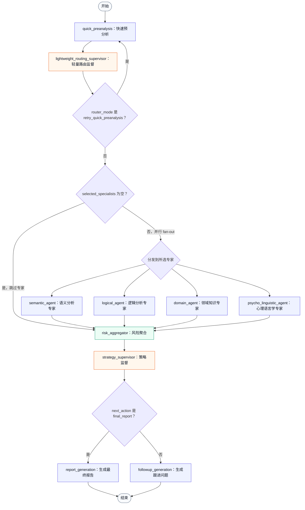

# v3 多 Agent 谎言指数测评系统 - 流程图

## 系统概述

本系统基于 LangGraph 构建，采用多 Agent 协作架构，用于分析对话内容、识别风险信号，并生成相应的追问或最终报告。当前工作流包含快速预分析、轻量路由、按需专家分析、风险聚合、策略监督和输出生成等阶段。

当前版本要点：

- `quick_preanalysis` 一次 LLM 调用完成事实抽取、异常检测、旧异常状态更新和表层风险判断。
- `lightweight_routing_supervisor` 负责决定是否跳过专家、调用哪些专家，或在 quick preanalysis 缺少关键标签时回跳重跑一次。
- 专家节点按 `selected_specialists` 并行 fan-out，未选中的专家不会执行。
- 无论是否调用专家，后续都会进入 `risk_aggregator`。
- `strategy_supervisor` 根据全局状态决定继续追问还是生成最终报告。
- 一次 `graph.invoke()` / `graph.stream()` 只执行到 `followup_generation` 或 `report_generation` 后结束；多轮循环由 `run_cli.py` 或 `app.py` 负责。

---

## 节点类型说明

| 类型 | 说明 |
|------|------|
| Agent 节点 | 调用 LLM 进行分析、判断或生成 |
| 规则节点 | 纯 Python 代码逻辑，基于条件判断、数学计算或数据操作 |
| 混合节点 | 先执行规则判断，必要时再调用 LLM |

---

## 核心状态 `DialogueState`

系统维护一个全局状态对象 `DialogueState`，在节点间传递，主要包含：

- 基础对话状态：`round_id`、`max_rounds`、`dialogue_history`、`current_user_text`
- 事实与异常：`facts_table`、`current_facts`、`anomalies_table`、`current_anomalies`
- 快速预分析结果：`has_new_fact`、`surface_risk_score`、`severity`、`confidence`、`quick_fact_summary`、`quick_signal_summary`
- schema 重试状态：`schema_error`、`schema_errors`、`quick_preanalysis_retry_count`
- 专家分析结果：`specialist_results`、`called_specialists`
- 风险聚合结果：`dimension_scores`、`lie_index`、`risk_explanation`
- 路由与策略控制：`routing_decision`、`selected_specialists`、`next_action`、`priority_issue`、`followup_strategy`、`target_anomaly_id`、`stop_reason`
- 输出结果：`last_followup_question`、`followup_history`、`final_report`

---

## 流程图

---

## 与 `graph.py` 的对应关系

`build_graph()` 注册的节点：

- `quick_preanalysis`
- `lightweight_routing_supervisor`
- `semantic_agent`
- `logical_agent`
- `domain_agent`
- `psycho_linguistic_agent`
- `risk_aggregator`
- `strategy_supervisor`
- `followup_generation`
- `report_generation`

条件路由：

- `route_after_routing_supervisor()`：
  - `routing_decision["router_mode"] == "retry_quick_preanalysis"`：回到 `quick_preanalysis`
  - `selected_specialists == []`：进入 `risk_aggregator`
  - `selected_specialists` 非空：并行发送到对应专家节点
- `route_after_strategy_supervisor()`：
  - `next_action == "final_report"`：进入 `report_generation`
  - 其他情况：进入 `followup_generation`

终止边：

- `followup_generation -> END`
- `report_generation -> END`

---

## 已删除或不在当前图中的旧节点

当前流程图不再包含以下旧版节点：

- `quick_fact_extraction`
- `quick_signal_detection`
- `debate_gate`
- `debate_node`
- `lightweight_risk_aggregator`
- `state_update`

不要在文档或图中恢复这些节点，除非代码重新引入对应实现。
